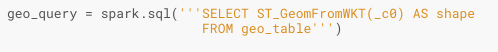
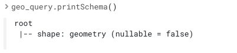

# Apache-Sedona-Spatial-Analytics
The following instructions will help you get up and running with Apache Sedona, a distributed computing framework for geospatial analytics. To learn more about Sedona, check out the **[documentation](https://docs.cloudera.com/machine-learning/cloud/index.html)**.

### CML Requirements
To run this demo you will need to launch a CML Session with the following settings. Please ensure you have the runtime shown below or it will likely not work.
```
Editor: Workbench
Kernel: Python 3.7 or above
Edition: Standard
Version: 2021.12
Enable Spark: Spark 2.4.7 - CDP 7.2.11 - CDE 1.13 - HOTFIX
```

### Project Setup
Open a CML Session and run the following command to install Sedona without PySpark:
```
!pip3 install -r requirements.txt --no-deps
```

### Configuring the Spark Session
Before running any geospatial analytics, you will need to configure your Spark Session with the following 3 steps:
1. Imports: You will need to import SparkSession and SedonaRegistrator.
```
from pyspark.sql import SparkSession
from sedona.register import SedonaRegistrator
```
2. SparkSession: Be sure to include the **[Maven coordinates](https://sedona.apache.org/download/maven-coordinates/)** for the sedona-python-adapter. Make sure to note the version of Spark that you are using.
```
spark = SparkSession\
    .builder\
    .appName("Python")\
    .master("local[*]")\
    .config('spark.jars.packages',
           'org.apache.sedona:sedona-python-adapter-2.4_2.11:1.0.1-incubating') \
    .getOrCreate()
```
3. SedonaRegistrator: This will make all SedonaSQL functions available in your SparkSession
```
SedonaRegistrator.registerAll(spark)
```

### Reading the data into spark
We will use the following code to read the data into Spark as a DataFrame
```
df = spark.read.option("delimiter", "|").csv("county_small.tsv", header=False)
```

using `df.show()`, the data appears as follows:


Lastly, we will create a temporary table to perform Spark SQL commands against the table:
```
df.createOrReplaceTempView("geo_table")
```

### Preparing the data for geospatial analysis
running `df.printSchema()` we will notice that column c0 is of type 'String'


We will need to convert this column to a Sedona geometric data type before performing any analysis. This can be accomplished using the ST_GeomFromWKT() function in Spark SQL:



To verify this change, we can run `geo_query.printSchema()`



### Conclusion
With these steps completed, you should be good to get up and running with Sedona! For more in-depth examples, check out this **[example](https://sedona.apache.org/tutorial/sql-python/)**